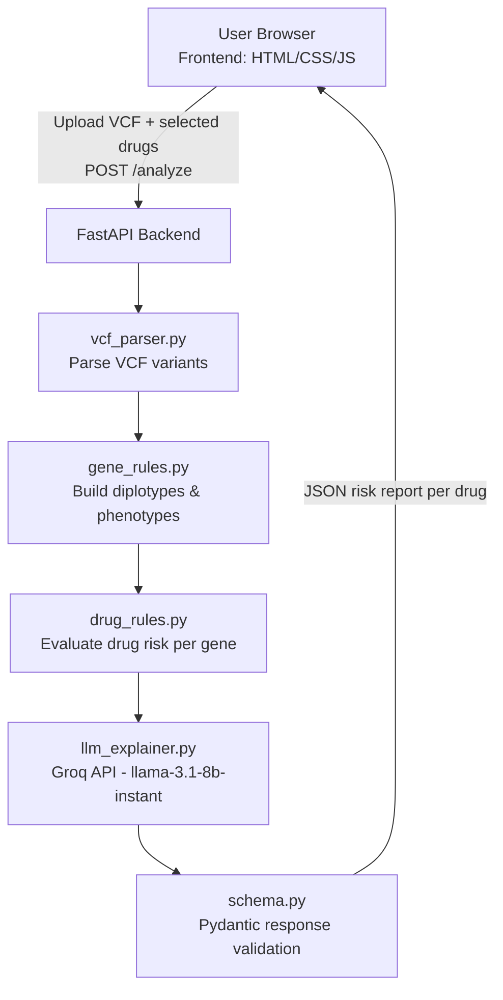

# 🛡️ PharmaGuard AI
**AI-assisted pharmacogenomic risk assessment — upload a VCF file, select medications, and get CPIC-aligned, explainable drug-gene risk reports.**


## Overview

PharmaGuard AI is a full-stack prototype that turns raw genetic variant data (VCF files) into plain-language, clinically-framed guidance on how a patient's genetics might affect their response to specific medications. It combines a small, deterministic pharmacogenomics rule engine with an LLM (via the Groq API) that translates the structured results into a readable clinical explanation — without letting the model invent or reinterpret the underlying genetics.

## Problem Statement

Many commonly prescribed drugs are metabolized differently depending on a patient's genetic makeup. Genes such as `CYP2D6`, `CYP2C19`, `CYP2C9`, `SLCO1B1`, `TPMT`, and `DPYD` are known to affect how patients process drugs like codeine, warfarin, clopidogrel, simvastatin, azathioprine, and fluorouracil. This information exists in pharmacogenomic guidelines (e.g. CPIC), but is not always easy for a non-specialist to interpret directly from a raw VCF file.

## Solution

PharmaGuard AI accepts a VCF file and a list of medications, then:

1. Parses the VCF for pharmacogenomic variants relevant to six supported genes.
2. Builds a diplotype and phenotype (e.g. Poor/Intermediate/Normal Metabolizer) for each gene.
3. Runs each selected drug against a rule table that maps gene phenotype → risk label, severity, and confidence.
4. Sends the structured result to an LLM with a strict, guideline-constrained prompt to produce a human-readable clinical explanation.
5. Returns a structured JSON response (validated against a Pydantic schema) that the frontend can render as a risk report.

## Key Features

- **VCF upload and parsing** for pharmacogenomic variants (`GENE`, `STAR`, `RS` INFO tags + `GT` genotype).
- **Diplotype construction** and **phenotype calling** for 6 genes: `CYP2D6`, `CYP2C19`, `CYP2C9`, `SLCO1B1`, `TPMT`, `DPYD`.
- **Rule-based drug risk evaluation** for 6 drugs: Codeine, Warfarin, Clopidogrel, Simvastatin, Azathioprine, Fluorouracil — each mapped to a risk label (`Safe`, `Adjust Dosage`, `Toxic`, `Ineffective`, `Unknown`), a severity level, and a confidence score.
- **LLM-generated clinical explanation** (via Groq's `llama-3.1-8b-instant`) that is explicitly instructed to stay strictly within the structured data and not speculate.
- **Structured, schema-validated API response** (Pydantic models) covering risk assessment, genetic profile, clinical recommendation, LLM explanation, and quality metrics.
- **Multi-drug analysis in a single request** — the `/analyze` endpoint accepts a comma-separated list of drugs and returns one risk report per drug.
- **Standalone CLI debug script** (`debug_vcf.py`) for testing the parsing → diplotype → phenotype → risk pipeline without going through the API.

## How It Works

1. A user uploads a VCF file and selects one or more medications (as seen in the app's Analysis Input screen).
2. The frontend sends the file and drug list to the backend's `POST /analyze` endpoint as `multipart/form-data`.
3. The backend parses the VCF, extracting variants that carry `GENE`, `STAR`, and `RS` INFO annotations and a non-reference genotype.
4. For each of the 6 supported genes, a diplotype is constructed from the detected star alleles (defaulting to `*1/*1` when no variant is found).
5. Each diplotype is converted into a phenotype (e.g. `NM`, `IM`, `PM`) using a fixed lookup table.
6. For each requested drug, the relevant gene's phenotype is looked up in the drug rule table to produce a risk label, severity, and confidence score.
7. The structured result, along with detected rsIDs, is passed to the Groq LLM to generate a clinical-style explanation.
8. All results are assembled into a schema-validated JSON response and returned to the frontend for display (risk badge, genetic profile, clinical recommendation, and AI explanation).

## System Architecture



## Tech Stack

| Category | Technology |
|---|---|
| **Backend** | Python, FastAPI, Uvicorn |
| **Data validation** | Pydantic (`schema.py`) |
| **AI/ML** | Groq API, `llama-3.1-8b-instant` model (explanation generation only — risk scoring itself is rule-based, not ML-based) |
| **Frontend** | HTML, CSS, vanilla JavaScript |
| **File format handled** | VCF (Variant Call Format), custom-annotated with `GENE`/`STAR`/`RS` INFO fields |
| **Dev/debug tooling** | `debug_vcf.py` command-line pipeline tester |

## Project Structure

```
Pharma-Guard/
├── README.md
└── pharmaguard-ai-main/
    ├── .gitignore
    ├── backend/
    │   ├── main.py            # FastAPI app and /analyze endpoint
    │   ├── vcf_parser.py       # VCF file parsing logic
    │   ├── gene_rules.py       # Diplotype construction + phenotype lookup tables
    │   ├── drug_rules.py       # Drug -> gene -> risk/severity/confidence rules
    │   ├── llm_explainer.py    # Groq LLM prompt & explanation generation
    │   ├── schema.py           # Pydantic response models
    │   ├── debug_vcf.py        # CLI script to test the pipeline locally
    │   ├── requirements.txt    # Backend Python dependencies
    │   ├── test.vcf            # Small sample VCF for testing
    │   └── demo_high_risk.vcf  # Sample VCF with variants across all 6 genes
    └── Frontend/
        ├── index.html          # Landing page
        ├── style.css           # Styling
        └── script.js           # Client-side result-rendering logic (stub)
```

## Installation and Setup

### Prerequisites

- Python 3.10+ (for FastAPI/Pydantic compatibility)
- A [Groq API key](https://console.groq.com/) (required for LLM explanations)

### Backend

```bash
# 1. Navigate to the backend folder
cd pharmaguard-ai-main/backend

# 2. (Recommended) create a virtual environment
python -m venv venv
source venv/bin/activate      # Windows: venv\Scripts\activate

# 3. Install dependencies
pip install -r requirements.txt

# 4. Set your Groq API key (see Environment Variables below)
export GROQ_API_KEY=your_key_here   # Windows: set GROQ_API_KEY=your_key_here

# 5. Run the API server
uvicorn main:app --reload
```

The API will be available at `http://127.0.0.1:8000`.

### Frontend

```bash
cd pharmaguard-ai-main/Frontend
# Open index.html directly in a browser, or serve it statically, e.g.:
python -m http.server 5500
```

Then visit `http://127.0.0.1:5500`.

> The backend enables CORS for all origins (`allow_origins=["*"]`), so the frontend can be served from a different port/host during local development.

## Environment Variables

Create a `.env` file (or export the variable in your shell) in the `backend/` directory:

```env
# .env.example
GROQ_API_KEY=your_groq_api_key_here
```

`GROQ_API_KEY` is read via `os.getenv("GROQ_API_KEY")` in `llm_explainer.py` and is required for the LLM explanation step to succeed; if it is missing or invalid, that step returns an error message string instead of raising an exception.

## Usage

1. Start the backend and frontend as described above.
2. Open the app in a browser.
3. Upload a VCF file containing pharmacogenomic variants (see `test.vcf` or `demo_high_risk.vcf` for examples of the expected format).
4. Select one or more medications to assess from the supported list (Codeine, Warfarin, Clopidogrel, Simvastatin, Azathioprine, Fluorouracil).
5. Submit the analysis to receive, per drug: a risk label, severity, confidence score, detected genetic profile (gene, diplotype, phenotype, rsIDs), a clinical recommendation, and an AI-generated explanation.

## API Documentation

### `POST /analyze`

Analyzes a VCF file against one or more drugs and returns a pharmacogenomic risk report for each.

**Request:** `multipart/form-data`

| Field | Type | Description |
| `file` | file | VCF file to analyze |
| `drugs` | string | Comma-separated drug names, e.g. `CODEINE,WARFARIN` (case-insensitive) |

**Response:** `application/json` — an array with one object per requested drug:

```json
[
  {
    "patient_id": "PATIENT_001",
    "drug": "CODEINE",
    "timestamp": "2026-01-01T00:00:00Z",
    "risk_assessment": {
      "risk_label": "Adjust Dosage",
      "confidence_score": 0.85,
      "severity": "low"
    },
    "pharmacogenomic_profile": {
      "primary_gene": "CYP2D6",
      "diplotype": "*1/*4",
      "phenotype": "IM",
      "detected_variants": [
        { "rsid": "rs3892097" }
      ]
    },
    "clinical_recommendation": {
      "recommendation": "Refer to CPIC guidelines for dosing adjustments."
    },
    "llm_generated_explanation": {
      "summary": "..."
    },
    "quality_metrics": {
      "vcf_parsing_success": true
    }
  }
]
```

If the VCF cannot be parsed, the endpoint returns `{"error": "<message>"}` instead of the array above.

**Supported drugs and their associated gene:**

| Drug      |      Gene |
|-------------|--------|
| Codeine     | CYP2D6 |
| Warfarin    | CYP2C9 |
| Clopidogrel | CYP2C19|
| Simvastatin | SLCO1B1|
| Azathioprine | TPMT  |
| Fluorouracil | DPYD  |

A drug not in this table returns `risk_label: "Unknown"` with `confidence_score: 0.5`.

## AI/ML Details

| Aspect             |              Detail |
| **Model/API used** | Groq API, model `llama-3.1-8b-instant` |
| **Library**        | `groq` Python SDK |
| **Input**          | Gene, diplotype, phenotype, drug, risk label, severity, and detected rsIDs (all pre-computed by the rule engine) |
| **Processing**     | A system + user prompt instructs the model to explain the result strictly from the supplied structured data, follow CPIC-aligned reasoning, avoid reinterpreting allele function or speculating, and respond in under 8 sentences across four sections (summary, biological mechanism, clinical impact, recommendation rationale) |
| **Output**         | A plain-text clinical explanation string, returned as `llm_generated_explanation.summary` |
| **Role in the system** | The LLM only narrates results that were already determined by the deterministic rule engine (`gene_rules.py`, `drug_rules.py`) — it does not decide the risk label, severity, or confidence score itself |

## Future Scope

(Proposed — not currently implemented)

- Support for additional genes and drugs beyond the current 6-gene / 6-drug rule tables.
- More clinically rigorous diplotype calling (the current logic takes the first one or two detected star alleles per gene as a simplification).
- User authentication (the current login modal in `index.html` is UI-only and not wired to a backend).
- Persistent storage of patient records/history (uploaded files are currently only saved to a local `uploads/` folder).
- Automated tests for the parsing and rule-evaluation logic.


## Limitations

## Limitations

- The VCF parser currently expects a specific annotation format using `GENE`, `STAR`, and `RS` INFO keys.
- Diplotype construction is simplified and uses the first one or two detected star alleles per gene rather than full allele-function-based calling.
- Current pharmacogenomic risk and severity rules are based on hardcoded lookup tables covering 6 genes and 6 drugs.
- The `/analyze` endpoint currently uses a fixed `patient_id` (`PATIENT_001`).
- The LLM explanation feature depends on the external Groq API and a valid `GROQ_API_KEY`.
- The current version does not include user authentication, persistent patient-record storage, or an automated test suite.
